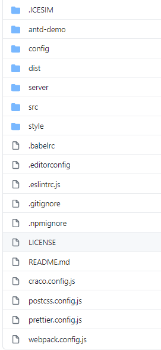
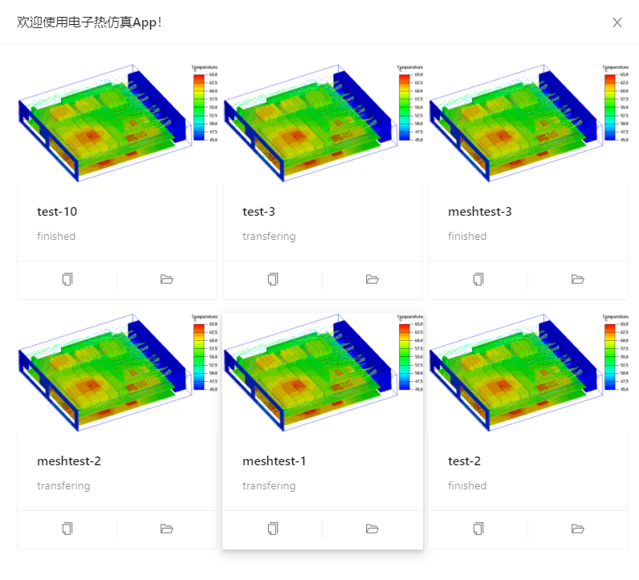
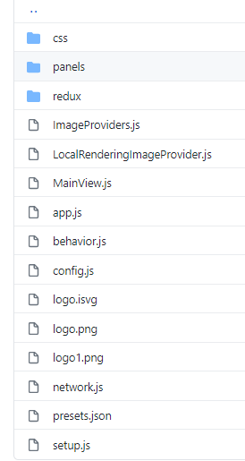
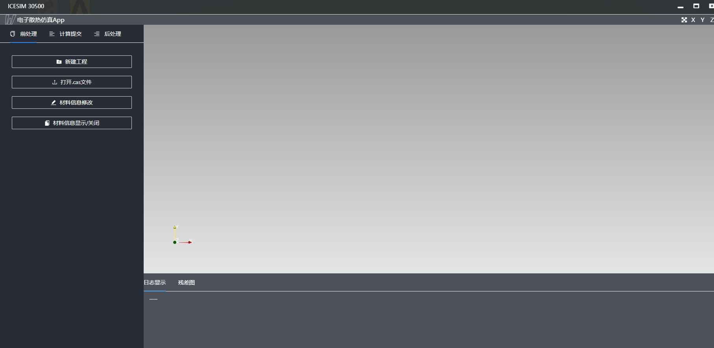

```
- 电子散热仿真App是一款前后端分离的仿真软件。
- 其中前端是基于visualizer（GitHub可搜到）开发，后端则是利用shell命令进行作业提交的操作，
- 笔者主要负责前端的操作，因此本文会详解前端如何修改及前后端传值接口如何编写。
```
### 电子散热仿真技术文档
#### 一、让代码跑起来
```
在执行以下操作时，请确定您的电脑上已经安装了paraview 5.8.1
```
- 首先从[github仓库](https://github.com/qiujingnan/-app2.0)(笔者为私人库，需要请联系)，将代码clone下来后，在本地运行以下代码（windows10）

```
# 仅首次打包
npm install
# 每次更改后打包
npm run build
```
- 运行pvpython

```
# 1. 设置Paraview安装路径，自行指定
$pvpath='C:\Program Files\ParaView 5.8.1-MPI-Windows-Python3.7-msvc2015-64bit'
# 2. 设置本仓库安装路径，自行指定
$simulator='C:\Users\xl\Desktop\ICESimulator\ICESimulator'
# 3. 设置后处理文件路径，自行指定
$case='C:\Users\xl\Desktop\testcase\s2s'
# 4. 运行后端
& "$pvpath/bin/pvpython.exe" "$simulator\server\pvw-visualizer.py" --content "$simulator\dist" --data "$case" --port=8888 --proxies "$simulator\server\proxies.json"
```
- 浏览器打开

```
 http://localhost:8888/
```
- linux系统运行以下代码

```
pvsharepath=/home/export/online3/amd_share/ParaView-5.8.0-MPI-Linux-Python3.7-64bit/share/paraview-5.8
pvpython58gl $pvsharepath/web/visualizer/server/pvw-visualizer.py --content $pvsharepath/web/visualizer/www/ --data /home/export/online3/amd_app --port 9999 --proxies /home/export/online3/amd_share/ParaView-5.8.0-MPI-Linux-Python3.7-64bit/share/paraview-5.8/web/visualizer/server/proxies.json
```
- 浏览器打开

```
http://IP地址:9999/
```
#### 二、前端框架
本项目中，前端主要使用react+antd进行开发，另外本项目前端只有一个路由，也就是实际上只有一页。因此，本项目需要您有javascript基础，css基础，react开发经验。
- 项目文件夹结构如下


```
-----------------------------
.ICESIM文件中存放新建的工程图片
-----------------------------
antd-demo为antd下载时的文件(配置文件不介绍)
-----------------------------
config为配置文件(配置文件不介绍)
-----------------------------
dist为打包后的运行文件(自动生成的打包文件不介绍)
-----------------------------
server中是后端调用的python文件
-----------------------------
src是我们需要修改的前端文件
-----------------------------
style中是visualizer自带的样式文件(样式文件不介绍)
-----------------------------
```
- .ICESIM文件介绍

```
.icesim文件中储存着所有工程信息的json文件
```

- server文件介绍

```
server文件夹下的customprotocols.py文件中存储着前端调用后端函数的大部分接口
```
下面来做一个简单介绍


```
其中，@exportRpc("getlogs) 是一个装饰器，将python函数readlog装饰成为一个js可读的getlogs函数
当然，这只是装饰器做的第一步，想要实现前后端传值远远不止这些，我将会在后面单独开个板块来解释前后端传值。
```
customprotocols.py文件中有很多这样的函数，每个函数都要经过前端调用才会生效，每个函数的意义本文不会介绍，您可以去看后端文档。

- src文件介绍

终于来到本文的重头戏了，src文件中保存着大部分前端代码，如果你需要修改前端界面，请打开这个文件夹。



- src/mainview.js

首先介绍src文件夹下的MainView.js文件(其它的不常用)，我们也以mainview.js为例，介绍下react文件：
```
去学react，我给你介绍不清楚 o(*≧▽≦)ツ┏━┓
``` 
mainview.js文件中的代码是所有代码的父组件，在首页所有功能的第一个div都由这个文件产生，如果你想知道具体每个功能所对应的位置，搜索功能搜索关键字是一个不错的选择。

主页：


- src/panels

panels文件夹下包含了所有子组件，前文提过mainview.js中所有父组件下的子组件都是从这个文件夹中导入的。


其中，ControlPanel中是控制组件，TimeController中为控制时间步的组件。
```
当你需要修改修改某个组件时，可以搜索关键字进行定位修改,遇到问题请去学习react
```
- src/redux

redux是react的一个高阶组件，重点控制的是组件之间的通信，src/redux/ducks定义了以下Actions：

| Action file | 含义 |
| -----| ------| 
| active | 活动源，视图变量 
| colors | 标量栏，预设的查找表，分段功能 
| files  | 服务器端目录列表和文件
| network  | 网络请求（Rpc呼叫) ,前后端传值时使用
| proxies  | 通信管道
| save  | 保存数据位置以及成功/失败的状态
| time  | 可用时间长步和当前牵引
| ui  | 面板可见性，属性分组的可折叠状态
| view  | 本地渲染和远程渲染的渲染性能
```
这一部分看起来比较复杂，需要有一定的redux基础，但是在使用时其实很简单，我们常常在前后端通信时使用，并且只需要改变其中不多的文件，我会在下文详细解释。
```

#### 三、前后端传值
##### 1、前端调用后端函数
step 1:在server/customprotocols中添加后端对应的函数,下面举例说明
```
>>@exportRpc("getlogs") //负责装饰，网络呼叫函数不叫readlog,而叫做getlogs
>>  def readlog(self,flag):
>>       log='我是日志'
>>       return log
```
step 2:在前端需要调用后端函数的位置，调用此函数
```
//默认已经从相应文件夹import了redux、network等模块
>>onBeforeChange={(editor, data, value) => {
>>          this.props.readlog(flag);}  //注意此处的调用readlog的格式
```
step 3:进行网络呼叫(Rpc)src/network.js
```
>>readlog(flag){
    //此处的call函数呼叫的是装饰函数getlogs,当前端调用readlog函数时，会找到Rpc为getlogs的函数进行调用
>>    return session.call('getlogs', [flag]);}, 
```
step 4:通信管道函数设置src/redux/ducks/proxies.js
```
export function readlog(flag) {
  return (dispatch) => {
    const netRequest = netActions.createRequest('chuandiflag');
    network
      .getClient()
      .Vector.readlog(flag)
      .then(
        (values) => {
          console.log('(values) => {');
          console.log(values);
          dispatch(netActions.success(netRequest.id, values));
        },
        (err) => {
          dispatch(netActions.error(netRequest.id, err));
        }
      );

    return netRequest;
  };
} 
```
至此便完成了前端向后端的通信！
##### 2、后端返回函数至前端
后端向前端返回值时，首先需要前端调用后端函数，然后通过后端函数return回前端。
step 1：向通信管道函数中新增return的函数src/redux/ducks/proxies.js
```
//新增函数名为getLog
----------------------------------------------------------
case 'GETLOG' :{
      const { log } = action;
      // return Object.assign({}, state, { describedic });
      state.log = log;
      return state;
    }
----------------------------------------------------------
export function getLog(log){
  return { type: 'GETLOG', log };
}
----------------------------------------------------------
export function readlog(flag) {
  return (dispatch) => {
    const netRequest = netActions.createRequest('chuandiflag');
    network
      .getClient()
      .Vector.readlog(flag)
      .then(
        (values) => {
          console.log('(values) => {');
          console.log(values);
          ---------------------------------------------
          dispatch(getLog(values)) //此处起名为getLog
          ---------------------------------------------
          dispatch(netActions.success(netRequest.id, values));
        },
        (err) => {
          dispatch(netActions.error(netRequest.id, err));
        }
      );

    return netRequest;
  };
} 
```
step 2 :在另一个通信函数中定义新函数
```
export const getLog = (state) => access(state).proxies.log;;
```
step 3:前端接收值，需要使用此函数的js中
```
//向return中加入下列代码
code:selectors.proxies.getLog(state), //日志的后端传值函数getlog
```
以上便完成了前后端的通信
#### 四、后端接口（API)
详情请查看后端文档
```2020年2月6日 邱晶楠
```